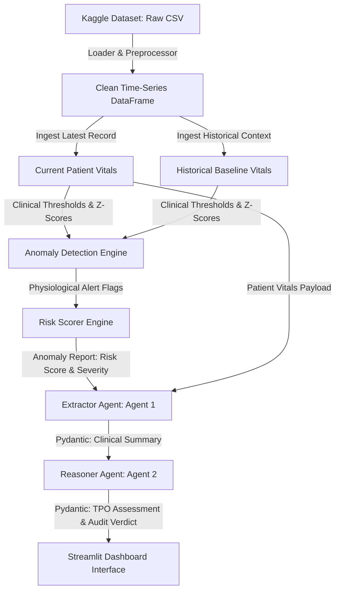

# CareVerify AI: Cotiviti Clinical Decision Support & Payment Integrity POC

CareVerify AI is an intelligent clinical decision support system (CDSS) and payment integrity auditing prototype. It leverages the **Human Vital Sign Dataset** to identify physiological anomalies through a hybrid analytical pipeline, extracts structured clinical contexts, and runs an agentic Chain-of-Thought (CoT) workflow to formulate Treatment, Payment, and Operational (TPO) audit recommendations.

---

## 🏗️ System Architecture & Data Flow

Below is the end-to-end data processing and multi-agent reasoning flow of the CDSS:



---

## 🌟 Key Features

1. **Ingestion & Data Engineering**: Parses patient metrics from the Kaggle dataset. Groups data by Patient ID and timestamp to enable longitudinal time-series baseline checks.
2. **Hybrid Anomaly Detection**:
   * **Rule-Based Checking**: Compares metrics against clinical thresholds (e.g., hypoxia if SpO2 < 95%, pyrexia/fever if Temp > 38°C).
   * **Z-Score Statistical Checking**: Computes rolling Z-scores for metrics relative to that specific patient's history, highlighting abnormal cardiac, respiratory, or blood pressure fluctuations.
3. **Multi-Agent Orchestration**:
   * **Extractor Agent (Agent 1)**: Evaluates raw vitals to compile a rich, structured clinical narrative summary (Pydantic `ClinicalSummary`).
   * **Reasoner Agent (Agent 2)**: Synthesizes the extracted summary and anomaly reports, executing a Chain-of-Thought analysis to yield Treatment, Payment, and Operational (TPO) recommendations alongside a final audit verdict.
4. **Adaptive Fallback Mechanism**: If no Fireworks API key is provided, the agents dynamically pivot to a localized clinical rule-based decision tree, generating custom assessments based on the patient's actual metrics to preserve a premium visual experience offline.
5. **Interactive Dashboard UI**: Features patient selectors, longitudinal telemetry line charts with anomaly marker overlays (Plotly), and live visualization of the Agentic Reasoning terminal.

---

## 🛠️ Tech Stack

* **Front-End Interface**: [Streamlit](https://streamlit.io/) (Data presentation dashboard)
* **Data Visualizations**: [Plotly](https://plotly.com/) (Interactive timeline charts)
* **Large Language Models**: [Fireworks AI (via OpenAI SDK)](https://api.fireworks.ai) (`accounts/fireworks/models/gpt-oss-20b` as default)
* **Structured Parsing**: [Pydantic v2](https://docs.pydantic.dev/) (Strict type constraints and serialization)
* **Mathematical Analytics**: [pandas](https://pandas.pydata.org/), [NumPy](https://numpy.org/), [SciPy](https://scipy.org/) (Z-scoring & data manipulation)
* **Dataset Management**: [kagglehub](https://github.com/Kaggle/kagglehub) (Dataset downloader)

---

## 🚀 Setup & Execution

### 1. Prerequisites
Ensure you have **Python 3.10+** installed on your system.

### 2. Clone and Setup Environment
Navigate into the workspace folder, enter the project directory, and create a virtual environment:
```bash
# Navigate to project directory
cd Proof-of-Concept

# Create virtual environment
python3 -m venv venv

# Activate virtual environment
source venv/bin/activate

# Install locked dependencies
pip install -r requirements.txt
```

### 3. API Configuration (Optional)
If you wish to test with live Fireworks reasoning, copy the environment template and insert your Fireworks key:
```bash
cp .env.example .env
```
Open `.env` and configure:
```env
FIREWORKS_API_KEY=your-actual-fireworks-key
FIREWORKS_MODEL=accounts/fireworks/models/gpt-oss-20b
```
*Note: If left blank or unconfigured, the dashboard will seamlessly operate in high-fidelity offline mode.*

### 4. Running the Dashboard
Launch the Streamlit app:
```bash
streamlit run ui/app.py
```
This will automatically preprocess the raw vital sign files on first load and launch the web interface at `http://localhost:8501` (or your local equivalent).

### 5. Running Automated Tests
Run unit tests verifying the thresholds, statistical models, and schemas:
```bash
python3 -m pytest tests/
```
All tests should pass.
